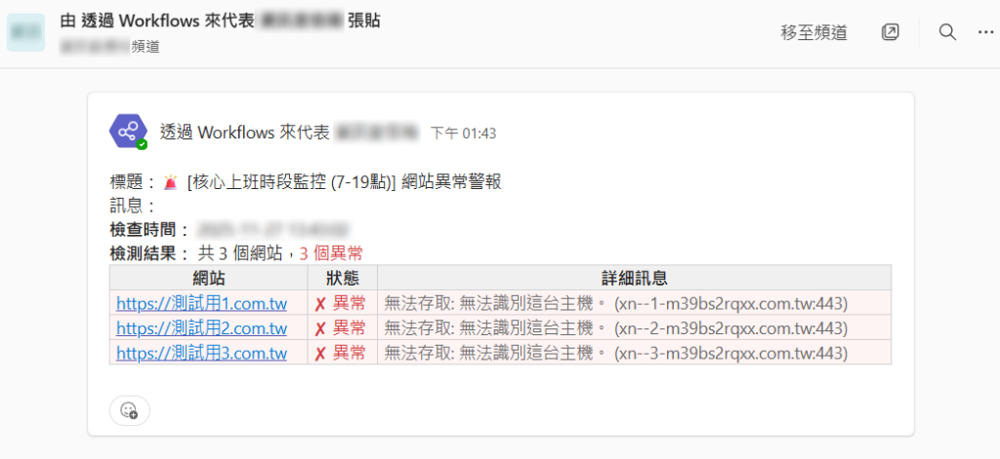

# API4-TEAMS - Teams 通知與網站監控服務

這是一個 .NET Core Web API 應用程式，提供 Microsoft Teams 通知發送功能，並回報網站健康監控服務。

## 功能特色

1.  **Teams 通知 API**: 提供 RESTful API 介面，可由外部系統 (如 PowerShell 腳本、其他應用程式) 呼叫，發送訊息至指定的 Teams 頻道。
2.  **網站監控服務 (WebsiteMonitorService)**: 
    - 背景服務定期檢查設定的網站清單。
    - 支援多種監控策略 (如：全天候、上班時間)，每個策略可獨立啟用/停用。
    - **聚合通知模式**：每個策略的所有網站檢查結果會彙整為**單一則** HTML 格式的 Teams 通知。
    - 支援條件式通知：可設定僅在網站異常時發送通知，或包含所有檢查結果。
    - 網站異常或恢復正常時，自動發送 HTML 表格通知。
3.  **背景自動執行服務 (Background Service) - 活性維護 (HeartBeat)**: 
    - 專門用於維持 Teams Flow 活性，克服 90 天無活動即停用的限制。
    - 每 80 天自動發送一次 Teams 訊息與 Email 報告。
    - **指定時間發送**：透過 `PreferredTime` 設定精確的發送時間點（如每天 09:00）。
    - **狀態持久化**：系統會將上次執行日期記錄於 `Logs/TeamsKeepAlive_LastRunDate.txt`，伺服器重啟後自動恢復排程，不會重新計算 80 天。
    - **過期補發機制**：若伺服器長期關機導致錯過預定時間，重啟後會立即補發心跳。
    - **SafeDelayAsync 防崩潰**：將超長等待時間分段執行，避免 .NET `Task.Delay` 超過 24.8 天上限導致 `ArgumentOutOfRangeException` 崩潰。
    - **雙重報警**：即使 Teams Webhook 失敗，也會透過 Email 告知管理員執行結果。
4.  **API Key 驗證**: 所有 API 請求皆需透過 `X-API-Key` Header 進行驗證。

## 定時執行機制 (Scheduled Execution)

本服務的 `WebsiteMonitorService` 採用精確的「整點觸發」機制，而非單純的間隔等待。

1.  **整點對齊**: 服務啟動後，會自動計算下一個「整分鐘」的時間點 (例如 09:00:00, 09:01:00)。
2.  **精確等待**: 使用 `Task.Delay` 等待至該時間點，確保檢查任務在每分鐘的 00 秒準時觸發。
3.  **策略判斷**: 
    - 每次觸發時，會遍歷所有 `MonitoringPolicies`。
    - 檢查當前時間是否在 `StartTime` 與 `EndTime` 區間內。
    - 檢查當前分鐘數是否符合 `IntervalMinutes` 的倍數 (例如每 5 分鐘檢查一次，則在 00, 05, 10... 分觸發)。
4.  **並行檢查**: 符合條件的網站將透過 `CheckWebsitesInParallelAsync` 進行並行 HTTP 請求，確保多網站監控時不會因單一網站回應過慢而拖累整體效能。

## 設定說明 (`appsettings.json`)

請參考 `appsettings.json` 進行設定：

### 1. API Key 設定
在 `Authentication:ApiKeys` 中設定允許的客戶端與金鑰。

```json
"ApiKeys": [
  {
    "Key": "your-secret-key",
    "ClientName": "Client Name"
  }
]
```

### 2. Teams Webhook 設定
在 `Teams` 區段設定 Webhook URL 與頻道。

- `WebhookUrls`: 定義頻道名稱與對應的 Teams Webhook URL。**注意：`default` 鍵值預設為空。**

```json
"Teams": {
  "WebhookUrls": {
    "default": "",
    "資訊室通知頻道": "https://another-webhook-url..."
  }
}
```

### 3. 活性維護設定 (KeepAlive)
在 `Teams:KeepAlive` 中設定心跳排程。

**屬性說明**：
- `Enabled`: 是否啟用自動打卡功能。
- `TestMode`: 測試模式開關。開啟後，間隔單位從「天」變成「分鐘」，方便驗證。
- `IntervalDays`: 發送週期（天數）。建議 80 天，微軟限制為 90 天。
- `TestIntervalMinutes`: 測試模式下的發送頻率（分鐘）。
- `PreferredTime`: 指定發送的時間點（24 小時制，格式 `HH:mm`）。
- `TargetChannel`: 發送目標頻道（需對應 `WebhookUrls` 中的 Key）。
- `LastRunDateFileName`: 紀錄上次執行時間的檔案名稱（存於 `Logs` 目錄）。

```json
"KeepAlive": {
  "Enabled": true,
  "TestMode": false,
  "IntervalDays": 80,
  "TestIntervalMinutes": 1,
  "PreferredTime": "09:00",
  "TargetChannel": "資訊室通知頻道",
  "LastRunDateFileName": "TeamsKeepAlive_LastRunDate.txt"
}
```

> **注意**：首次啟動時，若 `Logs/TeamsKeepAlive_LastRunDate.txt` 不存在，系統會以「啟動當天」為基準日開始計算。若想讓服務一上線就立即發送一次心跳，可手動建立該檔案並將內容設為一個過去的日期（如 `2024-01-01 00:00:00`）。

### 4. 監控策略設定
在 `Teams:MonitoringPolicies` 中定義監控規則。

**策略屬性說明**：
- `PolicyName`: 策略名稱 (用於日誌與通知標題)。
- `TargetChannel`: 指定該策略要發送通知的目標頻道名稱 (需對應 `WebhookUrls` 中的 Key)。
- `IsPolicyEnabled`: 策略總開關。設為 `false` 時，該策略完全不執行。
- `IsSuccessNotificationEnabled`: 成功通知開關。設為 `false` 時，僅在有網站異常時才發送通知；設為 `true` 時，每次檢查都會發送包含所有結果的通知。
- `StartTime` / `EndTime`: 監控時間窗口 (支援跨午夜，如 `22:00` - `02:00`)。
- `IntervalMinutes`: 檢查頻率 (分鐘)。系統會在符合頻率的整分鐘時觸發 (例如每 5 分鐘檢查，則在 00, 05, 10... 分觸發)。
- `Websites`: 要監控的網站清單。

**範例**：

```json
"MonitoringPolicies": [
  {
    "PolicyName": "核心上班時段監控 (7-19點)",
    "StartTime": "07:00",
    "EndTime": "19:00",
    "IntervalMinutes": 5,
    "TargetChannel": "OOO通知頻道",
    "IsPolicyEnabled": true,
    "IsSuccessNotificationEnabled": false,
    "Websites": [
      "https://.....",
      "https://....."
    ]
  }
]
```

**通知行為**：
- 上述範例中，因 `IsSuccessNotificationEnabled` 為 `false`，系統僅在有網站異常時才發送通知。
- 若所有網站都正常，則不發送通知 (但仍會記錄到日誌)。
- 通知內容為 HTML 表格格式，包含網站 URL、狀態 (✔/✘) 與詳細訊息。

**通知範例**：



*上圖為實際的 Teams 通知範例，顯示聚合通知模式的效果：單一則訊息包含多個網站的檢查結果，以清晰的 HTML 表格呈現。*

## 執行方式

1.  確認已安裝 .NET 8.0 SDK (或專案指定版本)。
2.  在專案根目錄執行：
    ```bash
    dotnet run
    ```

## API 使用範例
### 1. 快速測試 Teams (GET)
直接以瀏覽器造訪以下網址，即可發送一則發送到「資訊室通知頻道」的測試訊息：
`http://localhost:5127/api/v1/notifications/teams`

### 2. 手動執行活性維護心跳 (POST)
立即觸發完整的【背景服務(HeartBeat)】流程（Teams + Email）：
`POST http://localhost:5127/api/v1/notifications/teams/keepalive/trigger`

### 3. 發送自訂訊息 (PowerShell)
```powershell
$uri = "http://localhost:5127/api/v1/notifications/teams"
$apiKey = "your-secret-key"
$body = @{
    title = "測試通知"
    message = "這是一則測試訊息"
    targetChannel = "資訊室通知頻道"
} | ConvertTo-Json

Invoke-RestMethod -Uri $uri -Method Post -Headers @{ "X-API-Key" = $apiKey } -Body ([System.Text.Encoding]::UTF8.GetBytes($body)) -ContentType "application/json"
```

## 注意事項

- 若需發送中文內容，請確保 PowerShell 腳本編碼正確，並建議將 JSON Body 轉為 UTF-8 Bytes 發送。
- `WebsiteMonitorService` 會在應用程式啟動時自動執行。
- `TeamsFlowKeepAliveService` 啟動後會先讀取持久化檔案計算下一次排程，不會立即發送。
- 請確保伺服器上的應用程式對 `Logs` 資料夾擁有**讀寫權限**，否則持久化記錄會失敗。
- 伺服器的系統時鐘需保持準確（建議使用網域校時），以確保 `PreferredTime` 設定正確觸發。
